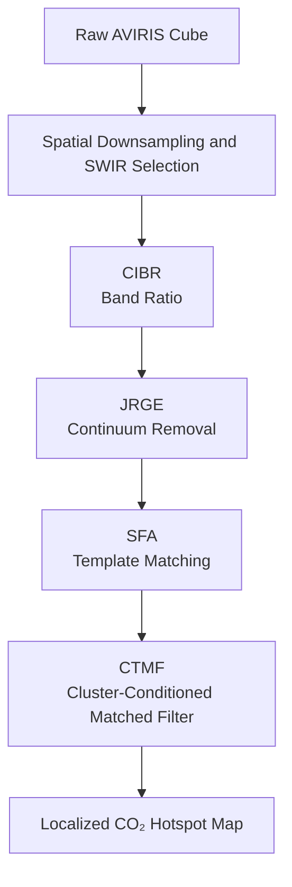
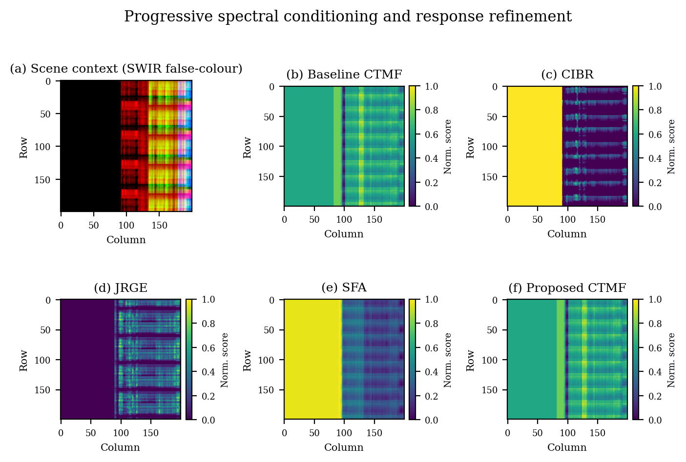
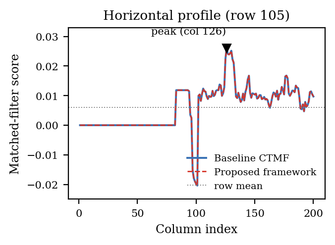
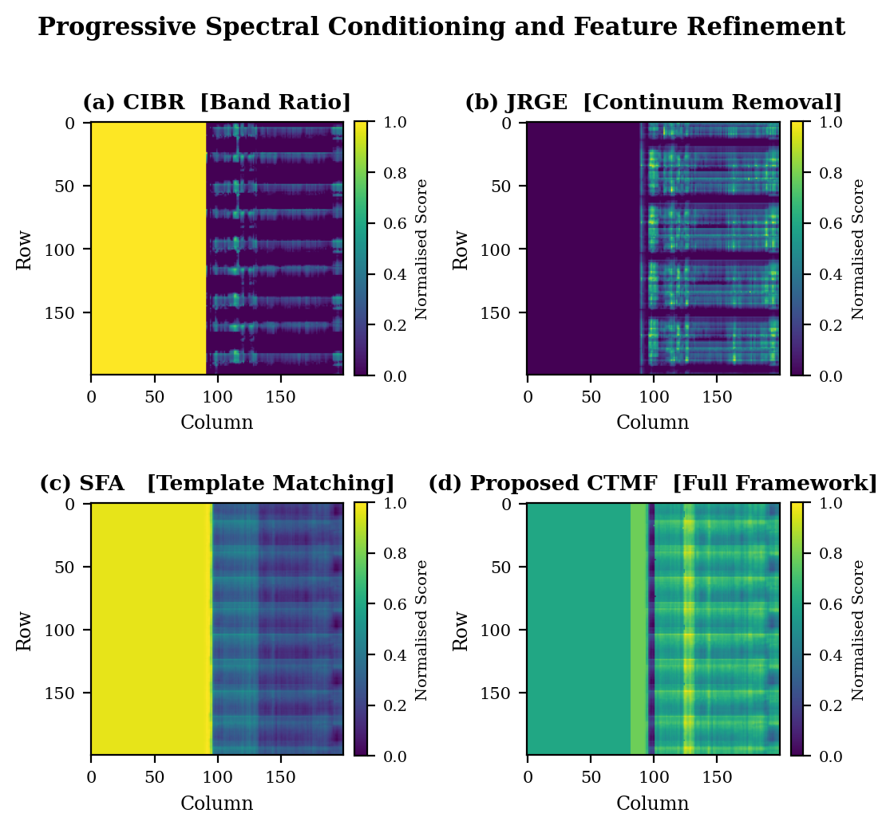
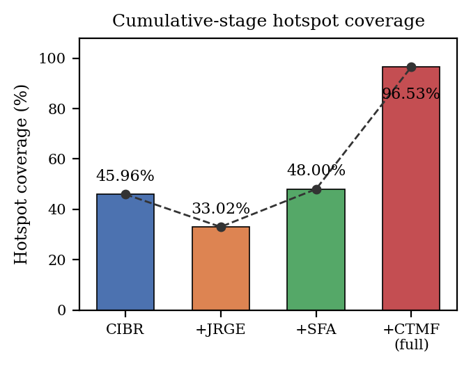
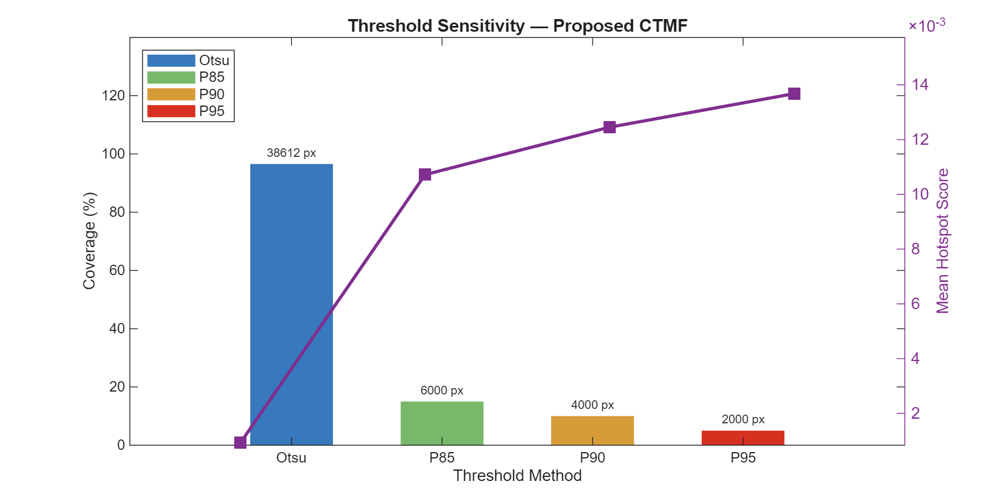
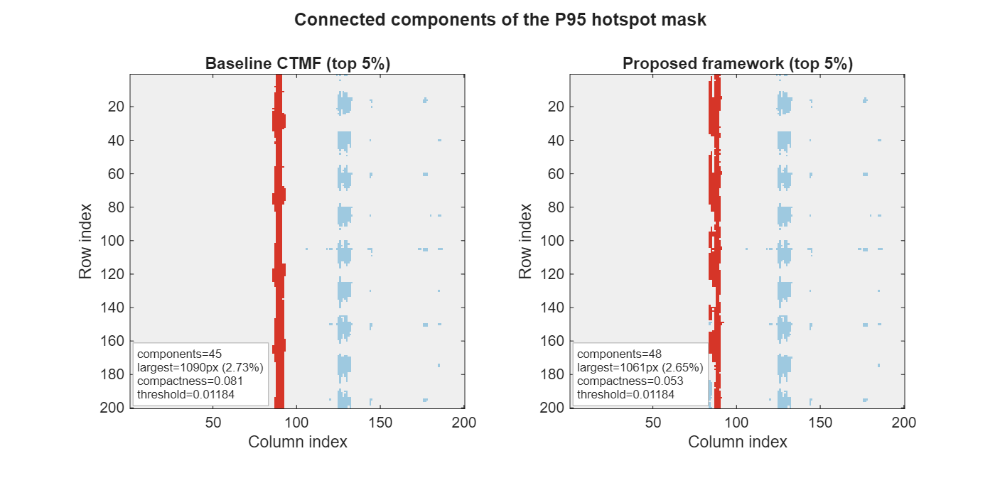
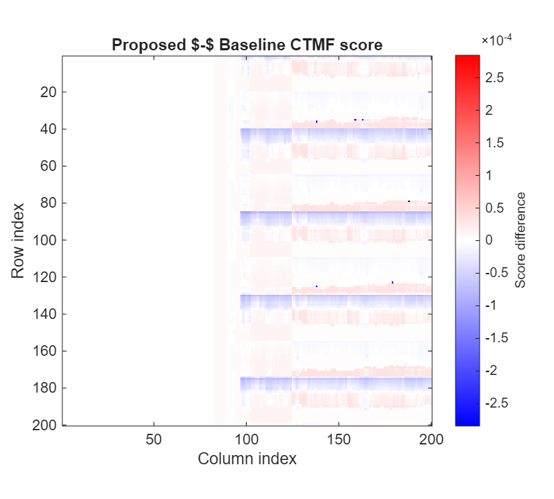
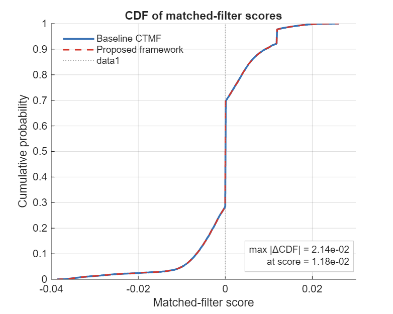
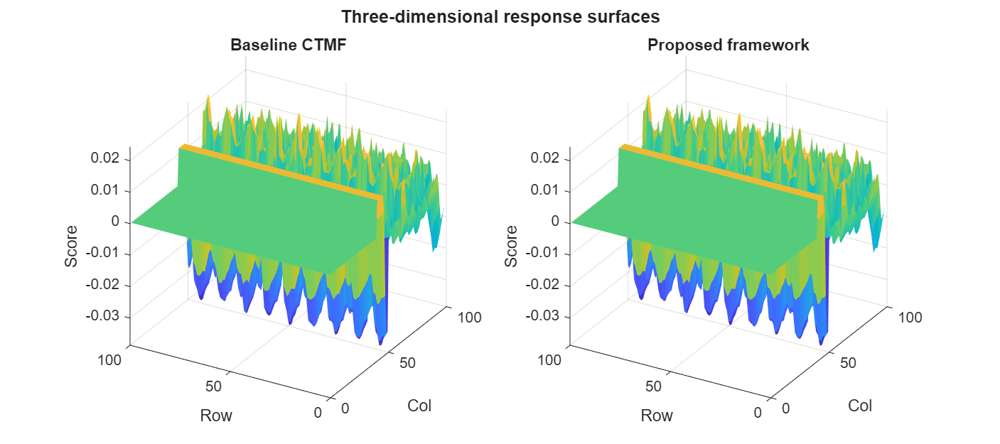

# 🌍 CO₂ Detection from Hyperspectral Imagery using AVIRIS Data

## 📌 Project Overview

This repository presents a comprehensive MATLAB framework for the detection, visualization, and statistical analysis of atmospheric CO₂ signatures using **Airborne Visible/Infrared Imaging Spectrometer (AVIRIS)** hyperspectral imagery.

Developed as part of the **MATLAB and Simulink Challenge**, the project implements a **Progressive Spectral Conditioning Pipeline** that sequentially combines four complementary algorithms:

1. **Continuum Interpolated Band Ratio (CIBR)**
2. **Joint Reflectance and Gas Estimator (JRGE)**
3. **Spectral Fitting Algorithm (SFA)**
4. **Cluster-Tuned Matched Filter (CTMF)**

Instead of relying on a single detector, the framework treats CO₂ retrieval as a sequence of spectral conditioning operations aimed at suppressing background variability and refining localized anomaly responses.

---

# 🏆 Features

* ✅ Efficient processing of large (30 GB+) AVIRIS hyperspectral cubes
* ✅ Automated spatial cropping and downsampling
* ✅ Progressive spectral conditioning architecture
* ✅ Multi-stage CO₂ anomaly detection
* ✅ Statistical validation and threshold robustness analysis
* ✅ Connected-component hotspot analysis
* ✅ Difference mapping and profile analysis
* ✅ Three-dimensional response visualization
* ✅ Publication-quality MATLAB figures

---

# 🛰 Workflow

The proposed framework performs CO₂ detection through a sequence of spectral conditioning operators.



---

# 1️⃣ Continuum Interpolated Band Ratio (CIBR)

The CIBR stage serves as a broad anomaly detector by evaluating the depth of the CO₂ absorption feature near **2.05 μm** relative to the local continuum.

* Left continuum: **2000–2020 nm**
* Right continuum: **2080–2100 nm**

Its objective is to maximize sensitivity to absorption signatures while preserving weak anomaly candidates.

---

# 2️⃣ Joint Reflectance and Gas Estimator (JRGE)

JRGE performs spline-based continuum removal and suppresses broadband reflectance variations.

This stage:

* reduces background interference,
* mitigates horizontal striping artifacts,
* enhances local spectral structures.

---

# 3️⃣ Spectral Fitting Algorithm (SFA)

SFA analyzes the entire **1500–2100 nm SWIR region**.

A dual-Gaussian CO₂ template centered at

* **1575 nm**
* **2005 nm**

is used to recover weak anomaly responses that may not be apparent during earlier stages.

---

# 4️⃣ Cluster-Tuned Matched Filter (CTMF)

The final stage computes cluster-specific covariance matrices using K-means clustering.

Cluster-conditioned statistics enable the framework to separate localized CO₂ signatures from heterogeneous backgrounds while preserving the underlying response topology.
# 📊 Visualizations

## Progressive Spectral Conditioning and Response Refinement

The anomaly response evolves gradually through successive conditioning stages while preserving the dominant structures present in the scene.

<p align="center">
  
</p>

**Figure 1.** Progressive spectral conditioning and response refinement showing the scene context, baseline CTMF response, and the successive outputs obtained after CIBR, JRGE, SFA, and the complete framework.

---

## Horizontal Profile Analysis

The row-wise matched-filter profile confirms that the dominant response peak is preserved after spectral conditioning.

<p align="center">
  
</p>

**Figure 2.** Horizontal matched-filter profile through the plume centre. The baseline CTMF and the proposed framework exhibit nearly identical peak locations and local contrast.

---

## Ablation Study

The intermediate responses illustrate the complementary role of each stage in progressively modifying the anomaly distribution.

<p align="center">
  
</p>

**Figure 3.** Progressive spectral conditioning and feature refinement corresponding to (a) CIBR, (b) JRGE, (c) SFA, and (d) the complete framework.

---

## Stagewise Hotspot Evolution

The spatial extent of anomaly responses changes across successive conditioning stages, reflecting the interaction between spectral sensitivity and response stabilization.

<p align="center">
  
</p>

**Figure 4.** Evolution of hotspot coverage across the conditioning pipeline.

---

## Threshold Sensitivity

Threshold robustness was investigated using Otsu and percentile-based thresholding strategies.

<p align="center">
  
</p>

**Figure 5.** Sensitivity of hotspot coverage and score statistics under Otsu, P85, P90, and P95 thresholding schemes.

---

## Connected Components and Hotspot Morphology

Connected-component analysis provides insight into the spatial organization of the top 5% hotspot mask.

<p align="center">
  
</p>

**Figure 6.** Connected-component analysis of the P95 hotspot mask comparing the baseline CTMF and the proposed framework.

---

## Difference Mapping

The score differences remain localized around high-response regions, indicating that spectral conditioning introduces only small corrections to the baseline response.

<p align="center">
  
</p>

**Figure 7.** Pixel-wise difference map obtained by subtracting the baseline CTMF response from the proposed framework.

---

## Distribution Preservation

Comparison of cumulative distribution functions demonstrates that the overall score statistics are largely preserved.

<p align="center">
  
</p>

**Figure 8.** Cumulative distribution functions of matched-filter scores for the baseline CTMF and the proposed framework.

---

## Three-Dimensional Response Surfaces

The response topology remains largely unchanged after spectral conditioning, indicating localized refinement rather than global distortion.

<p align="center">
  
</p>

**Figure 9.** Three-dimensional response surfaces corresponding to the baseline CTMF and the proposed framework.


# 📈 Stagewise Statistical Evolution

| Configuration     | Coverage (%) |  Mean | Std Dev | P95 Score |
| ----------------- | -----------: | ----: | ------: | --------: |
| CIBR              |        45.96 | 0.500 |   0.466 |     1.000 |
| CIBR + JRGE       |        33.02 | 0.142 |   0.188 |     0.520 |
| CIBR + JRGE + SFA |        48.00 | 0.599 |   0.356 |     0.965 |
| Full Framework    |        96.53 | 0.597 |   0.113 |     0.780 |

The reduction in standard deviation across successive stages indicates increasing stabilization of the response distribution.

---

# 📈 Baseline vs Proposed Framework

(Top 5% hotspot mask)

| Metric                 | Baseline CTMF | Proposed Framework |
| ---------------------- | ------------: | -----------------: |
| Maximum Score          |       0.02612 |            0.02612 |
| P95 Threshold          |       0.01184 |            0.01184 |
| Connected Components   |            45 |                 48 |
| Largest Component Area |         2.73% |              2.65% |
| Compactness            |         0.081 |              0.053 |

The proposed framework preserves global score statistics while introducing localized refinements in hotspot morphology.

---

# 🛠 Required Toolboxes

The project makes use of several MathWorks products:

* **Hyperspectral Imaging Toolbox**
* **Image Processing Toolbox**
* **Statistics and Machine Learning Toolbox**
* **Curve Fitting Toolbox**

---

# 📂 Dataset Preparation

Download AVIRIS `.hdr` and `.bin` files from:

* **NASA JPL AVIRIS Data Portal**

Place the files inside:

```text
datasets/
```

---

# 🚀 Usage

## Run Complete Pipeline

```matlab
>> main_co2_visualisation
```

---

## Generate Figures

```matlab
>> generate_figures
```

---

## Connected Components and Morphology

```matlab
>> analyse_hotspots
```

---

## Threshold Robustness Analysis

```matlab
>> threshold_analysis
```

---

# 📁 Repository Structure

```text
.
├── datasets/
├── output_figures/
├── co2_cibr.m
├── co2_jrge.m
├── co2_sfa.m
├── co2_ctmf.m
├── main_co2_visualisation.m
├── generate_figures.m
├── analyse_hotspots.m
├── threshold_analysis.m
└── README.md
```

---

# 📚 Citation

If you use this repository in your work, please cite:

```bibtex
@misc{co2_aviris_progressive,
  title={Progressive Spectral Conditioning Framework for CO₂ Detection from AVIRIS Hyperspectral Imagery},
  author={Your Name},
  year={2026},
  note={MATLAB and Simulink Challenge}
}
```

---

# 📄 License

This project is distributed under the **MIT License**.

See the `LICENSE` file for details.
