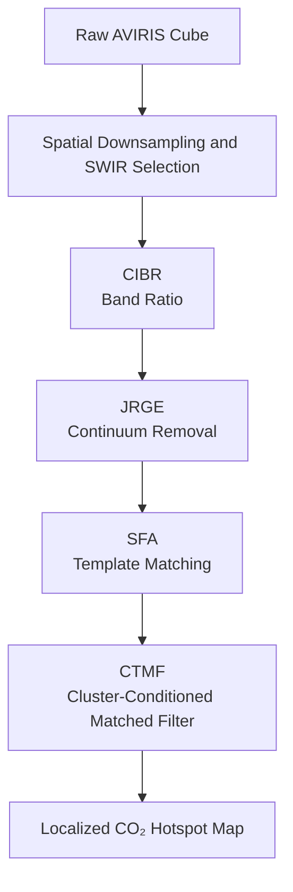
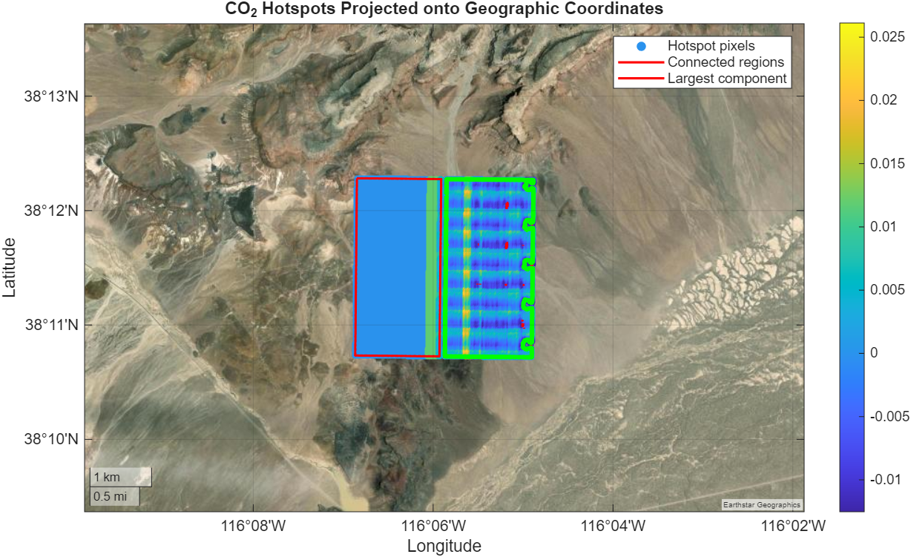

# 🌍 CO₂ Detection from Hyperspectral Imagery using AVIRIS Data

## 📌 Project Overview

This repository presents a comprehensive MATLAB framework for the detection, visualization, and statistical analysis of atmospheric CO₂ signatures using **Airborne Visible/Infrared Imaging Spectrometer (AVIRIS)** hyperspectral imagery.

Developed as part of the **MATLAB and Simulink Challenge**, the project implements a **Progressive Spectral Conditioning Pipeline** that sequentially combines four complementary algorithms:

1. **Continuum Interpolated Band Ratio (CIBR)**
2. **Joint Reflectance and Gas Estimator (JRGE)**
3. **Spectral Fitting Algorithm (SFA)**
4. **Cluster-Tuned Matched Filter (CTMF)**

Instead of relying on a single detector, the framework treats CO₂ retrieval as a sequence of spectral conditioning operations aimed at suppressing background variability and refining localized anomaly responses.

---

# 🏆 Features

* ✅ Efficient processing of large (30 GB+) AVIRIS hyperspectral cubes
* ✅ Automated spatial cropping and downsampling
* ✅ Progressive spectral conditioning architecture
* ✅ Multi-stage CO₂ anomaly detection
* ✅ Statistical validation and threshold robustness analysis
* ✅ Connected-component hotspot analysis
* ✅ Difference mapping and profile analysis
* ✅ Three-dimensional response visualization
* ✅ Publication-quality MATLAB figures

---

# 🛰 Workflow

The proposed framework performs CO₂ detection through a sequence of spectral conditioning operators.



---

# 1️⃣ Continuum Interpolated Band Ratio (CIBR)

The CIBR stage serves as a broad anomaly detector by evaluating the depth of the CO₂ absorption feature near **2.05 μm** relative to the local continuum.

* Left continuum: **2000–2020 nm**
* Right continuum: **2080–2100 nm**

Its objective is to maximize sensitivity to absorption signatures while preserving weak anomaly candidates.

---

# 2️⃣ Joint Reflectance and Gas Estimator (JRGE)

JRGE performs spline-based continuum removal and suppresses broadband reflectance variations.

This stage:

* reduces background interference,
* mitigates horizontal striping artifacts,
* enhances local spectral structures.

---

# 3️⃣ Spectral Fitting Algorithm (SFA)

SFA analyzes the entire **1500–2100 nm SWIR region**.

A dual-Gaussian CO₂ template centered at

* **1575 nm**
* **2005 nm**

is used to recover weak anomaly responses that may not be apparent during earlier stages.

---

# 4️⃣ Cluster-Tuned Matched Filter (CTMF)

The final stage computes cluster-specific covariance matrices using K-means clustering.

Cluster-conditioned statistics enable the framework to separate localized CO₂ signatures from heterogeneous backgrounds while preserving the underlying response topology.
# 📊 Visualizations

## Progressive Spectral Conditioning and Response Refinement

The anomaly response evolves gradually through successive conditioning stages while preserving the dominant structures present in the scene.

<p align="center">
  
</p>

**Figure 1.** Progressive spectral conditioning and response refinement showing the scene context, baseline CTMF response, and the successive outputs obtained after CIBR, JRGE, SFA, and the complete framework.

---

## Horizontal Profile Analysis

The row-wise matched-filter profile confirms that the dominant response peak is preserved after spectral conditioning.

<p align="center">
  
</p>

**Figure 2.** Horizontal matched-filter profile through the plume centre. The baseline CTMF and the proposed framework exhibit nearly identical peak locations and local contrast.

---

## Ablation Study

The intermediate responses illustrate the complementary role of each stage in progressively modifying the anomaly distribution.

<p align="center">
  
</p>

**Figure 3.** Progressive spectral conditioning and feature refinement corresponding to (a) CIBR, (b) JRGE, (c) SFA, and (d) the complete framework.

---

## Stagewise Hotspot Evolution

The spatial extent of anomaly responses changes across successive conditioning stages, reflecting the interaction between spectral sensitivity and response stabilization.

<p align="center">
  
</p>

**Figure 4.** Evolution of hotspot coverage across the conditioning pipeline.

---

## Threshold Sensitivity

Threshold robustness was investigated using Otsu and percentile-based thresholding strategies.

<p align="center">
  
</p>

**Figure 5.** Sensitivity of hotspot coverage and score statistics under Otsu, P85, P90, and P95 thresholding schemes.

---

## Connected Components and Hotspot Morphology

Connected-component analysis provides insight into the spatial organization of the top 5% hotspot mask.

<p align="center">
  
</p>

**Figure 6.** Connected-component analysis of the P95 hotspot mask comparing the baseline CTMF and the proposed framework.

---

## Difference Mapping

The score differences remain localized around high-response regions, indicating that spectral conditioning introduces only small corrections to the baseline response.

<p align="center">
  
</p>

**Figure 7.** Pixel-wise difference map obtained by subtracting the baseline CTMF response from the proposed framework.

---

## Distribution Preservation

Comparison of cumulative distribution functions demonstrates that the overall score statistics are largely preserved.

<p align="center">
  
</p>

**Figure 8.** Cumulative distribution functions of matched-filter scores for the baseline CTMF and the proposed framework.

---

## Three-Dimensional Response Surfaces

The response topology remains largely unchanged after spectral conditioning, indicating localized refinement rather than global distortion.

<p align="center">
  
</p>

**Figure 9.** Three-dimensional response surfaces corresponding to the baseline CTMF and the proposed framework.


# 📈 Stagewise Statistical Evolution

| Configuration     | Coverage (%) |  Mean | Std Dev | P95 Score |
| ----------------- | -----------: | ----: | ------: | --------: |
| CIBR              |        45.96 | 0.500 |   0.466 |     1.000 |
| CIBR + JRGE       |        33.02 | 0.142 |   0.188 |     0.520 |
| CIBR + JRGE + SFA |        48.00 | 0.599 |   0.356 |     0.965 |
| Full Framework    |        96.53 | 0.597 |   0.113 |     0.780 |

The reduction in standard deviation across successive stages indicates increasing stabilization of the response distribution.

---

# 📈 Baseline vs Proposed Framework

(Top 5% hotspot mask)

| Metric                 | Baseline CTMF | Proposed Framework |
| ---------------------- | ------------: | -----------------: |
| Maximum Score          |       0.02612 |            0.02612 |
| P95 Threshold          |       0.01184 |            0.01184 |
| Connected Components   |            45 |                 48 |
| Largest Component Area |         2.73% |              2.65% |
| Compactness            |         0.081 |              0.053 |

The proposed framework preserves global score statistics while introducing localized refinements in hotspot morphology.

## 🗺️ Geospatial Visualization using the Mapping Toolbox

To further enhance the interpretability of the detected anomaly regions, the **MATLAB Mapping Toolbox** was incorporated into the framework. After thresholding the final CTMF response, hotspot pixels were projected into geographic coordinates using the AVIRIS metadata (UTM Zone 11N, WGS-84 datum, 14.4 m spatial resolution). The resulting anomaly regions were visualized on high-resolution satellite basemaps, allowing spatial inspection of plume morphology and connected-component structures.

### Geographic Projection of CO₂ Hotspots
The hotspot mask generated from the proposed framework was transformed from image coordinates into latitude and longitude coordinates and displayed over a satellite basemap. Pixel intensities correspond to the matched-filter score, while connected-component boundaries indicate coherent anomaly regions.

<p align="center">
  
  <br>
  <em><b>Figure 10.</b> Geographic projection of the thresholded CO₂ hotspot mask using the Mapping Toolbox. Hotspot pixels are visualized according to their matched-filter scores, while connected-component boundaries identify spatially coherent anomaly regions.</em>
</p>

### Enlarged View of the Geospatial Overlay
For improved visual interpretation, a zoomed representation of the detected hotspot regions is also provided. The enlarged view highlights the internal score distribution and the morphology of the connected components.

<p align="center">
  
  <br>
  <em><b>Figure 11.</b> Enlarged satellite-based visualization of the detected hotspot regions showing score intensity variations and the spatial organization of connected anomaly structures.</em>
</p>

### 🧰 Toolbox Utilization
The project employs several MathWorks toolboxes throughout the detection and visualization pipeline:

| Toolbox | Purpose |
| :--- | :--- |
| **Hyperspectral Imaging Toolbox** | AVIRIS cube handling and spectral processing |
| **Image Processing Toolbox** | Thresholding, morphology, and connected components |
| **Statistics and Machine Learning Toolbox** | K-means clustering and statistical analysis |
| **Curve Fitting Toolbox** | Spline-based continuum estimation in JRGE |
| **Mapping Toolbox** | Geographic projection and satellite overlay visualization |

---

## 📂 Dataset Acquisition & Preparation

This project utilizes real-world hyperspectral data captured by the **Airborne Visible/Infrared Imaging Spectrometer (AVIRIS)**. 

### How to Access the Data
The AVIRIS data is publicly available and can be downloaded from the NASA Jet Propulsion Laboratory (JPL).
1. Navigate to the [NASA JPL AVIRIS Data Portal](https://aviris.jpl.nasa.gov/dataportal/).
2. Search for the required flightline/scene (e.g., flight lines covering regions of known gas emissions).
3. Download the calibrated surface reflectance data (typically denoted by `_rfl` in the filename).

### Required Files
For the framework to execute correctly, you must download the data pairs consisting of a header file and a binary data file:
* `*.hdr`: The header file containing essential geospatial metadata, wavelength information, and the projection parameters required for Mapping Toolbox integration.
* `*.bin` (or `*img`): The binary file containing the actual multi-band spectral reflectance measurements.

### Setup Instructions
Once downloaded, place the `.hdr` and `.bin` files directly into the `datasets/` directory of this repository:

```text
datasets/
├── your_scene_name.hdr
└── your_scene_name.bin
---


# 🛠 Required Toolboxes

The project makes use of several MathWorks products:

* **Hyperspectral Imaging Toolbox**
* **Image Processing Toolbox**
* **Statistics and Machine Learning Toolbox**
* **Curve Fitting Toolbox**

---

# 📂 Dataset Preparation

Download AVIRIS `.hdr` and `.bin` files from:

* **NASA JPL AVIRIS Data Portal**

Place the files inside:

```text
datasets/
```

---

# 🚀 Usage

## Run Complete Pipeline

```matlab
>> main_co2_visualisation
```

---

## Generate Figures

```matlab
>> generate_figures
```

---

## Connected Components and Morphology

```matlab
>> analyse_hotspots
```

---

## Threshold Robustness Analysis

```matlab
>> threshold_analysis
```

---

# 📁 Repository Structure

.
├── datasets/                    # Original AVIRIS hyperspectral data files
│   ├── *.hdr                    # Geospatial metadata and wavelength info
│   └── *.bin                    # Spectral reflectance measurements
│
├── output_figures/              # Publication-quality figures generated by the framework
│   ├── fig_stagewise6panel.png
│   ├── fig_profile.png
│   ├── fig_ablation2x2.png
│   ├── fig_hotspot_evolution.png
│   ├── threshold_sensitivity.png
│   ├── fig_connected.png
│   ├── fig_diffmap.png
│   ├── fig_cdf.png
│   ├── fig_3dsurface.png
│   ├── fig_geospatial_overlay.png
│   └── Figure_1.png
│
├── co2_cibr.m                   # CIBR anomaly detection script
├── co2_jrge.m                   # JRGE continuum removal script
├── co2_sfa.m                    # SFA template matching script
├── co2_ctmf.m                   # CTMF final matched filter script
│
├── main_co2_visualisation.m     # Master execution script
├── generate_figures.m           # Script to reproduce validation plots
├── analyse_hotspots.m           # Connected components analysis script
├── threshold_analysis.m         # Threshold robustness evaluation script
├── map_geospatial_overlay.m     # Geographic projection & satellite mapping script
│
└── README.md                    # Project documentation (this file)

---

# 📚 Citation

If you use this repository in your work, please cite:

```bibtex
@misc{co2_aviris_progressive,
  title={Progressive Spectral Conditioning Framework for CO₂ Detection from AVIRIS Hyperspectral Imagery},
  author={Your Name},
  year={2026},
  note={MATLAB and Simulink Challenge}
}
```

---

# 📄 License

This project is distributed under the **MIT License**.

See the `LICENSE` file for details.
